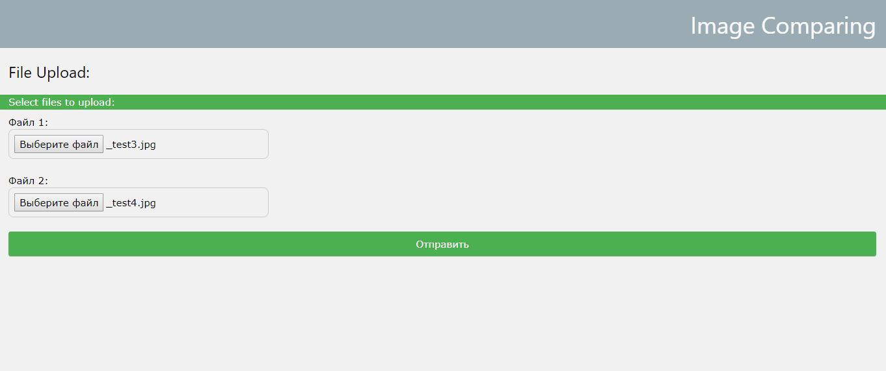

# CompareUltimate

Web-service, based on java servlets and .jsp, for deploy in Tomcat. It compares two uploaded image files and shows as a result first
image with red rectangels that mark the difference between images.

